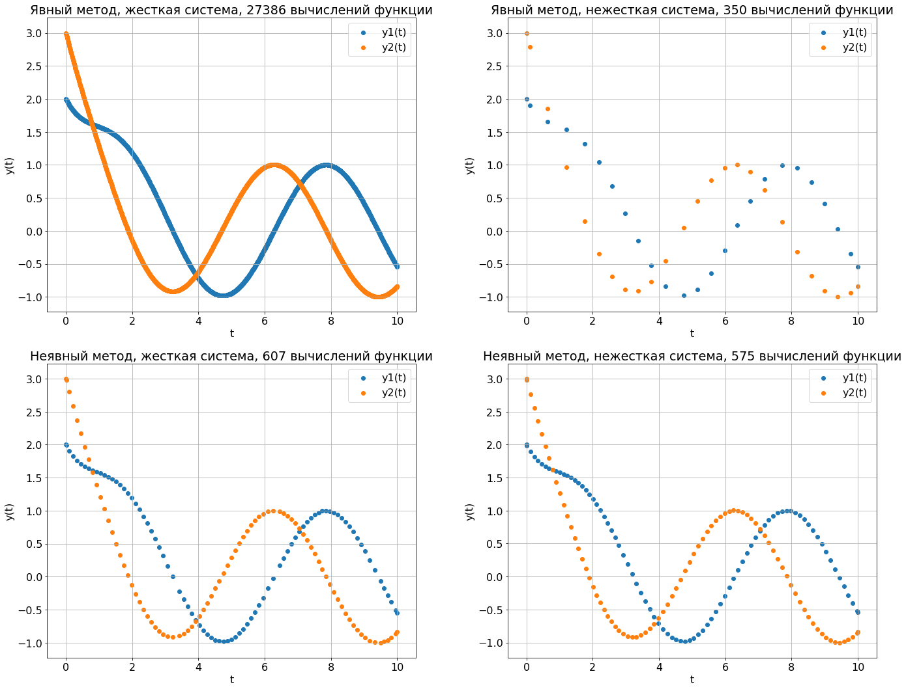

Что-нибудь ещё....

Системой однородных дифференциальных уравнений называется выражение
$ y^{(n)} = f(x, y, y', ..., y^{(n - 1)}) $
где $ \textbf{y} $ - вектор функций $ \textbf{y}(x) = (y_1(x), ..., y_n(x)) ) $, а $ f $ - вектор-фукнция от $ y $ и её производных.

---

**Методы Рунге-Кутта** - большой класс численных методов решения задачи Коши для ОДУ и их систем. Первые методы были сформулированы немецкими математиками К. Д. Т. Рунге и М. В. Куттой

Далее имеем систему ОДУ  $ y' = f(x, y) $, где
$ y = y(x) = (y_1(x), y_2(x), ... y_m(x)) $
$ x \in [a, b], \;\; a,b \in \mathbb{R} $
$ f: [a, b] \times \mathbb{R^m} -> \mathbb{R^m} $

Хотим научиться строить аппроксимацию для $ y $. Утверждение: если нам известно значение $ y(x_n) $, то
$$
y(x_{n + 1}) = y(x_n) + \int_{x_n}^{x_{n + 1}} f(t, y(t)) dt
$$
Основная идея методов Рунге-Кутта - аппроксимация этого интеграла численными методами.

---

$$
y(x_{n + 1}) = y(x_n) + h \sum_\limits{i = 1}^{s} b_i k_i
$$

$ h $ - величина шага по x,
$ k_i $ вычисляется по формуле
$ k_1 = f(x_n, y(x_n)) $
$ k_2 = f(x_n +c_2 h, y(x_n) + a_{21}\cdot h \cdot k_1) $
...
$ k_s = f(x_n + c_s h, y(x_n) + \sum\limits_{i = 1}^{s-1} a_{si} h k_i) $

---

Конкретный метод определяется векторами $ c, b $ и матрицей $ A $. Обычно их записывают как таблицу, называемой *таблицей Бутчера*

|       0 |            |            |      |                |         |
| ------: | :--------- | :--------- | ---- | -------------- | ------- |
| $ с_2 $ | $ a_{21} $ |            |      |                |         |
| $ с_3 $ | $ a_{31} $ | $ a_{32} $ |      |                |         |
|     ... | ...        | ...        | ...  |                |         |
| $ с_s $ | $ a_{s1} $ | $ a_{s2} $ | ...  | $ a_{ss - 1} $ |         |
|         | $ b_1 $    | $ b_2 $    | ...  | $ b_{s - 1} $  | $ b_s $ |

Для этих коэффициентов должно выполняться условие 
$ \sum\limits_{j = 1}^{i - 1} a_{ij} = c_i $    для  $ i = 2, ..., s $ 
Чтобы требуемый метод имел порядок точности $ p $ - необходимо обеспечить условие
$ \hat{y}(h + x_0) - y(h + x_0) = O(h^{p + 1}) $, где $ \hat{y}(h + x_0) $ - приближение, полученное по методу Рунге-Кутта

Известные значения $ s $

|   p   |  1   |  2   |  3   |  4   |  5   |  6   |  7   |  8   |
| :---: | :--: | :--: | :--: | :--: | :--: | :--: | :--: | :--: |
| min s |  1   |  2   |  3   |  4   |  5   |  7   |  9   |  11  |

---

#### Явные методы Рунге-Кутта

Коэффициенты метода RK4 имеет вид 
$$
A = \begin{pmatrix}
 0& 0& 0& 0\\
 \frac{1}{2}& 0 & 0& 0 \\
 0& \frac{1}{2} & 0& 0 \\
 0& 0 & 1& 0
\end{pmatrix}
\;\;
c^T = (0, \frac{1}{2}, \frac{1}{2}, 1)
\;\;
b = (\frac{1}{6}, \frac{1}{3}, \frac{1}{3}, \frac{1}{6})
$$
Коэффициенты метода Эйлера
$$
A = \begin{pmatrix}
 0
\end{pmatrix}
\;\;
c^T = (0)
\;\;
b = (1)
$$
Что задаёт формулу $ y(x_{n + 1}) = y(x_n) + hf(x_n, y(x_n))  $ - самый простой метод Рунге-Кутта

---

#### Неявные методы Рунге-Кутта

$$
y(x_{n + 1}) = y(x_n) + h \sum_\limits{i = 1}^{s} b_i k_i 
$$

$$
k_i = f(x_n + c_ih, y(x_n) + h \sum\limits_{j = 1}^s a_{ij} k_j), \;\; i = 1, ..., s
$$

#### Примеры

Неявный метод Эйлера
$$
A = \begin{pmatrix}
 1
\end{pmatrix}
\;\;
c^T = (1)
\;\;
b = (1)
$$
Таким образом получается $ k_1 = f(x_n + h, y(x_n) + h k_1) $  и  $ y(x_{n + 1}) = y(x_n) + h k_1 $

Неявный метод Radau IA
$$
A = \begin{pmatrix}
 \frac{1}{4} & -\frac{1}{4}\\
 \frac{1}{4} & \frac{5}{12}
\end{pmatrix}
\;\;
c^T = (0, \frac{2}{3})
\;\;
b = (\frac{1}{4}, \frac{3}{4})
$$

---

#### Почему тема устойчивости важна? Зачем нужны неявные методы?

Жесткая:
$$\begin{cases} y_1' = -2  y_1 + y_2 + 2  sin{t} \\
y_2' = 998 y_1 - 999  y_2 + 999  (\cos{t} - \sin{t})
\end{cases}$$

Нежесткая: 
$$\begin{cases}
y_1' = -2  y_1 + y_2 + 2  \sin{t}\\
y_2' = y_1 - 2  y_2 + 2  (\cos{t} - \sin{t}))
\end{cases}$$
Обе системы имеют одинаковое решение:
$$
\begin{cases}
y_1 = 2  e ^ {-t} + \sin{t}\\
y_2 = 2  e ^ {-t} + \cos{t}
\end{cases}
$$

Получаем решения с фиксированной точностью




---

#### A-stability
Рассмотрим уравнение $y'(x) = k \cdot y(x)$, его решением является $y(x) = e^{k \cdot x} + С$. Возьмем шаг $h > 0$, $x_{0} = 0$, $y_{0} = 1$ и решим уравнение числено, тогда для любого метода Рунге-Кутты $y_{n+1} = R(z) * y_{n}$, где $z = h \cdot k$. $R(z)$ называется функцией устойчивости. Если $|R(z)| < 1$, то $\lim\limits_{n \to \infty} y_n = 0$. Множество $\{z \in C \;\big| \; |R(z)| \le 1\}$ называется областью устойчивости. Если область устойчивости включает в себя отрицательную часть комплексной плоскости $C^{-} = \{z \in C \; \big| \; Re(z) \le 0\}$, то метод называется `A-устойчивым`. 


Для явного и неявного метода Эйлера легко вычислить $ R(z) $ самостоятельно:  

- Явный метод:
$$
y_{n+1} = y_n + h \cdot  f(x_n, y_n)\\
y_{n+1} = y_n + h \cdot k \cdot y_n \\  
y_{n+1} = y_n \cdot (1 + h \cdot k)\\
y_{n+1} = y_n \cdot (1 + z)\\   
R(z) = 1 + z
$$
- Неявный метод:
$$
y_{n+1} = y_n + h \cdot f(x_n, y_{n+1})\\  
y_{n+1} = y_n + h \cdot k \cdot y_{n+1}\\
y_{n+1} \cdot (1 - h \cdot k) = y_n\\  
y_{n+1} = y_n \cdot \frac1{1 - z}\\
R(z) = \frac1{1 - z}
$$

---

Есть две формулы для расчета $R(z)$, которые работают для обоих видов методов и одна только для явных методов:  

>- `RungeKutta.R_i1(self, z)`  
>- `RungeKutta.R_i2(self, z)`  
>- `RungeKutta.R_e(self, z, p)` где `p` - порядок точности, для `RK4` `p = 4`

$$
R_{i1}(z) = 1 + zb^T(I - zA)^{-1}e = \frac{det(I - zA + zeb^T)}{det(I - zA)} = R_{i2}(x) \\
R_e(z) = 1 + z + \frac{z^2}{2!} + ... + \frac{z^p}{p!} + O(z^{p + 1})
$$
где $e$ - вектор столбец из единиц


---

## Примеры
Посмотрим, как работают численные методы Эйлера на примере уравнения $y'(x) = k \cdot y(x)$, $k = -15$, $x_0 = 0$, $y_0 = 1$ при разных величинах шага $h$.

---


---


---

## B-stability
Возьмем нелинейное уравнение $y' = f(x, y)$. Пусть $y(x), z(x)$ - любые два решения. Метод является B-устойчивым, если из условия $(f(x, y(x)) - f(x, z(x)), y(x) - z(x)) \le 0$ следует, что $\forall h \ge 0 \;\; ||\hat{y_1} - y_1|| \le ||\hat{y_0} - y_0||$, где $\hat{y_1}$ и $y_1$ численные аппроксимации  после одного шага при начальных условиях $\hat{y_0}$ и $y_0$ соответственно. Если метод удовлетворяет двум критериям::
>- $b_{i} \ge 0, i = 1,\ldots,s$  
>- $M = (m_{ij}) = (b_{i} \cdot a_{ij} + b_{j} \cdot a_{ji} - b_{i} \cdot b_{j}), i = 1,\ldots,s, j = 1,\ldots,s$ неотрицательно определена  

то метод является `B-устойчивым`. Можно проверить с помощью метода `RungeKutta.is_B_stable(self)`.


```python
print('Is RK4 B-stable:', rk4.is_B_stable())
print('Is Radau IA B-stable:', ria.is_B_stable())
print('Is forward Euler method B-stable:', fe.is_B_stable())
print('Is backward Euler method B-stable:', be.is_B_stable())
```

    Is RK4 B-stable: no
    Is Radau IA B-stable: yes
    Is forward Euler method B-stable: no
    Is backward Euler method B-stable: yes
---

## L-stability
Если метод является `A-устойчивым` и $\lim\limits_{z \to \infty}R(z) = 0$, то метод является `L-устойчивым`. Если матрица `a` неявного метода не вырождена и удовлетворяет любому из двух критериев:  
>- $a_{sj} = b_{j}, j = 1,\ldots,s$
>- $a_{i1} = b_{i}, i = 1,\ldots,s$  

то метод является `L-устойчивым`. Можно проверить с помощью метода `RungeKutta.is_L_stable(self)`.


```python
print('Is RK4 L-stable:', rk4.is_L_stable())
print('Is Radau IA L-stable:', ria.is_L_stable())
print('Is forward Euler method L-stable:', fe.is_L_stable())
print('Is backward Euler method L-stable:', be.is_L_stable())
```

    Is RK4 L-stable: no
    Is Radau IA L-stable: maybe
    Is forward Euler method L-stable: no
    Is backward Euler method L-stable: yes
---

## Order Stars
Область определяется так: $\{z \in C \;\big| \;|R(z)| > |e^z|\}$. Есть много разных теорем, в качестве примера можно привести факт, для явных методов Рунге-Кутты число листов звезды всегда равно порядку точности метода + 1 и при $z\to0$ угловые размеры всех $2 \cdot (p + 1)$ секторов равны 


---

## Литература
Hairer, Ernst; Wanner, Gerhard (1991), Solving ordinary differential equations II: Stiff and differential-algebraic problems (стр. 40-59)  
Lambert, J.D (1991), Numerical Methods for Ordinary Differential Systems. The Initial Value Problem (стр. 232-237)  
Iserles, Arieh (1996), A First Course in the Numerical Analysis of Differential Equations (стр. 56-63)  